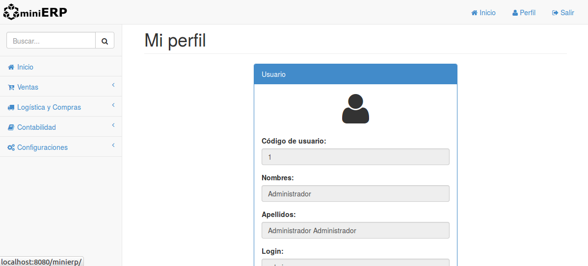
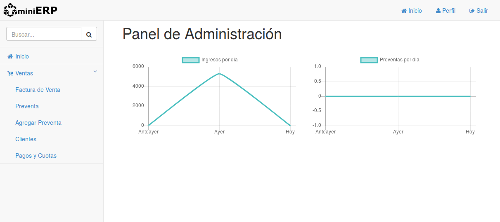

# MiniERP WEB




## Requerimientos

- JDK8
- MySQL 5.1.x
- Tomcat 8.0.x

## Instalación

- Ejecutar los archivos SQL que están dentro de la carpeta scripts en una base de datos 'episerp' en el siguiente orden: SCHEMA.sql, VIEWS.sql, PROCEDURES.sql, DATA.sql
- Opcionalmente ejecutar TRIGGERS.sql y TEST.sql para datos de prueba
- Crear el usuario alumno
``` sql
CREATE USER 'alumno'@'%' IDENTIFIED BY '1234';
GRANT USAGE ON *.* TO 'alumno'@'%' IDENTIFIED BY '1234';
GRANT ALL PRIVILEGES ON `episerp`.* TO 'alumno'@'%';
```
- Modificar hibernate.cfg.xml o db.properties para la conexion a la base de datos (ubicados en src/main/resources)
- Instalar las dependencias del archivo pom.xml con Maven.
- Lanzarlo con un servidor Tomcat
- Usuario: admin, Contraseña: admin
